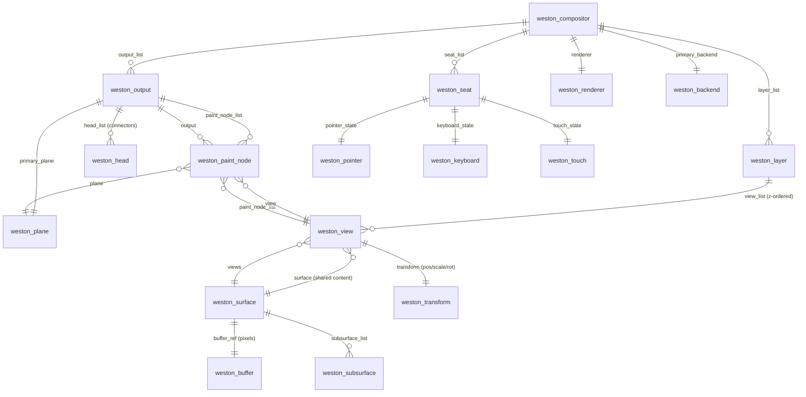
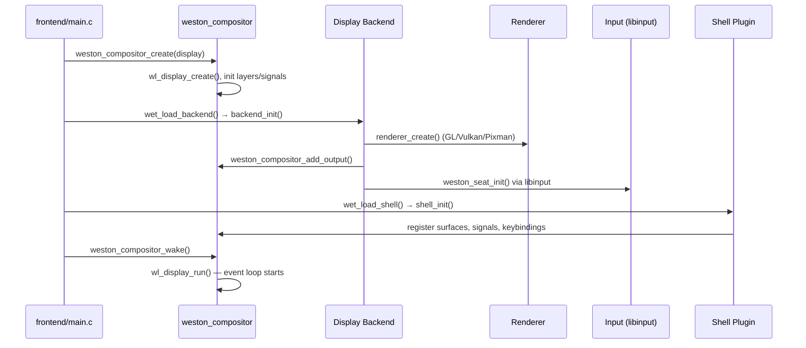
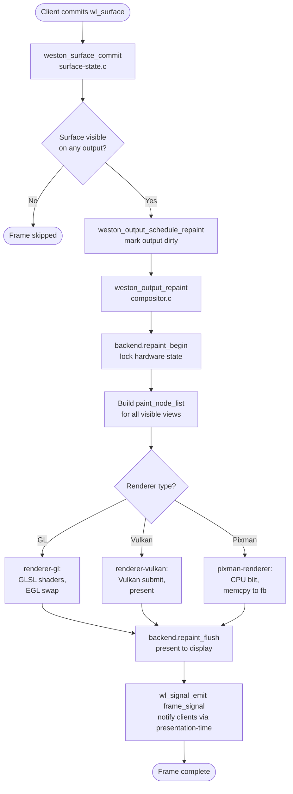
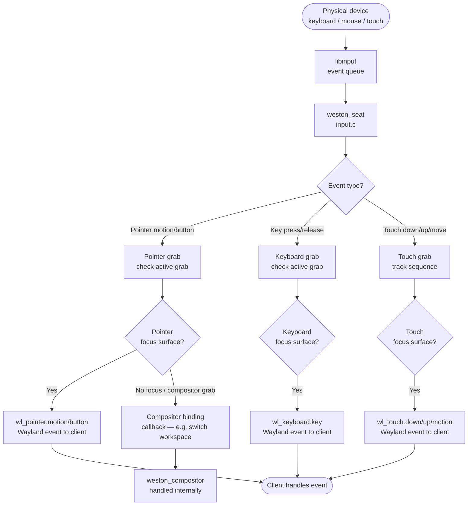
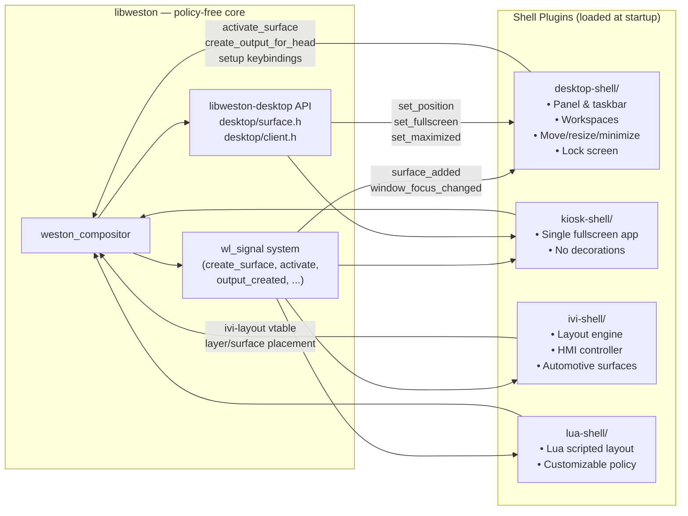
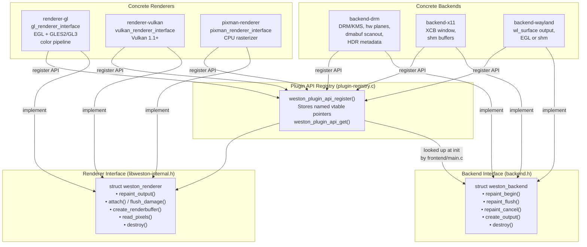
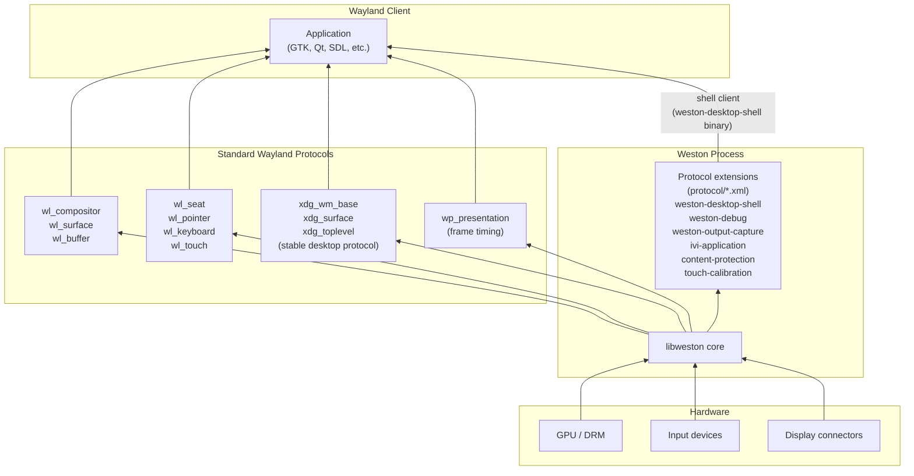
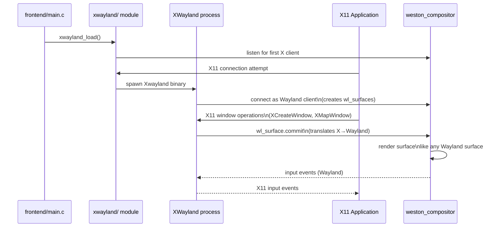

# Weston Architecture Diagrams

This document provides Mermaid diagrams to help new contributors understand how Weston's modules fit together.

Weston is a Wayland compositor built on **libweston** — a reusable library that handles the core rendering, input, and surface management. On top of libweston, pluggable **backends**, **renderers**, and **shells** are loaded at runtime to form a complete compositor.

---

## 1. Top-Level Module Overview

High-level view of all major components and how they are grouped.

```mermaid
graph TB
    subgraph Frontend["Frontend (frontend/)"]
        MAIN["main.c\nEntry point, CLI args,\nloads backend + shell"]
    end

    subgraph Core["Core Library (libweston/)"]
        COMP["compositor.c\nEvent loop, output/layer/view\nmanagement, repaint scheduler"]
        INPUT["input.c\nSeats, pointer, keyboard,\ntouch, libinput integration"]
        SURF["surface-state.c\nDouble-buffered surface\nstate commits"]
        COLOR["color*.c\nICC profiles, color space\nconversion, HDR/tone mapping"]
        DESKTOP["desktop/\nXDG shell protocol\n(window management API)"]
        PLUGREG["plugin-registry.c\nVtable-based API registry\nfor plugins at runtime"]
        XWAYLAND["xwayland/\nBridge for running\nX11 apps on Wayland"]
    end

    subgraph Renderers["Renderers (libweston/)"]
        REND_GL["renderer-gl/\nOpenGL/EGL GPU rendering,\nshaders, color transforms"]
        REND_VK["renderer-vulkan/\nVulkan GPU rendering"]
        REND_PIX["pixman-renderer.c\nSoftware (CPU) rendering\nfallback"]
    end

    subgraph Backends["Display Backends (libweston/backend-*)"]
        BE_DRM["backend-drm/\nKMS/DRM — native hardware\ndisplays, GPU planes"]
        BE_X11["backend-x11/\nNested inside X11\nwindow"]
        BE_WL["backend-wayland/\nNested inside another\nWayland compositor"]
        BE_HEAD["backend-headless/\nVirtual output,\nno display hardware"]
        BE_RDP["backend-rdp/\nRemote Desktop Protocol"]
        BE_VNC["backend-vnc/\nVNC remote display"]
        BE_PW["backend-pipewire/\nPipeWire video capture"]
    end

    subgraph Shells["Shell Plugins (shell directories)"]
        SH_DESK["desktop-shell/\nFull desktop: panel, workspaces,\nwindow controls, lock screen"]
        SH_KIOSK["kiosk-shell/\nSingle-app kiosk / embedded"]
        SH_IVI["ivi-shell/\nAutomotive / IVI layouts"]
        SH_FULL["fullscreen-shell/\nOne app fullscreen only"]
        SH_LUA["lua-shell/\nScriptable via Lua"]
    end

    subgraph Shared["Shared Utilities (shared/)"]
        SHARED["Config parser, matrix math,\nCairo helpers, image loading,\nframe decorations"]
    end

    subgraph Protocol["Protocol Extensions (protocol/)"]
        PROTO["Weston-specific .xml files:\ndesktop-shell, debug,\noutput-capture, IVI, etc."]
    end

    MAIN --> COMP
    MAIN --> BE_DRM & BE_X11 & BE_WL & BE_HEAD & BE_RDP & BE_VNC & BE_PW
    MAIN --> SH_DESK & SH_KIOSK & SH_IVI & SH_FULL & SH_LUA

    COMP --> INPUT
    COMP --> SURF
    COMP --> COLOR
    COMP --> DESKTOP
    COMP --> PLUGREG
    COMP --> XWAYLAND

    COMP --> REND_GL & REND_VK & REND_PIX

    SH_DESK & SH_KIOSK & SH_IVI & SH_FULL & SH_LUA --> COMP
    SH_DESK & SH_KIOSK --> DESKTOP

    BE_DRM & BE_X11 & BE_WL & BE_HEAD --> COMP

    COMP --> SHARED
    SH_DESK --> SHARED
```

---

## 2. Compositor Core Data Model

The key data structures inside `libweston` and how they relate.

---

## 3. Initialization Sequence

How Weston starts up from `main()` to entering the event loop.

---

## 4. Per-Frame Rendering Pipeline

What happens every time a client updates a surface and a frame is rendered.

---

## 5. Input Event Pipeline

How a physical keystroke or mouse movement flows from hardware to a Wayland client.

---

## 6. Shell Plugin Architecture

How shell plugins interact with the compositor to implement window management policies.

---

## 7. Backend & Renderer Plugin System

How pluggable backends and renderers register and expose their interfaces.

---

## 8. Wayland Protocol Layer

How Weston's protocol extensions slot into the standard Wayland protocol stack.

---

## 9. Color Management Pipeline

How colors are transformed from client surfaces to the physical display.

```mermaid
flowchart LR
    subgraph Client["Client Side"]
        CBUF["Client buffer\n(sRGB or\ncustom ICC profile)"]
    end

    subgraph ColorMgmt["Color Management (libweston/color*.c + LCMS2)"]
        PROFILE["Color profile\nassignment per surface"]
        CS["Color space\nconversion matrix"]
        TONE["Tone mapping /\ngamma curve (EOTF)"]
        LUT["3D color LUT\n(GPU texture)"]
    end

    subgraph Renderer["GL Renderer (renderer-gl/)"]
        SHADER["GLSL shader\napplies LUT + matrix"]
        FB["Output framebuffer"]
    end

    subgraph Display["Physical Display"]
        HWGAMMA["HW gamma ramp\n(DRM CRTC LUT)"]
        SCREEN["Screen pixels"]
    end

    CBUF --> PROFILE
    PROFILE --> CS
    CS --> TONE
    TONE --> LUT
    LUT --> SHADER
    SHADER --> FB
    FB --> HWGAMMA
    HWGAMMA --> SCREEN
```

---

## 10. XWayland Integration

How legacy X11 applications run inside Weston via XWayland.

