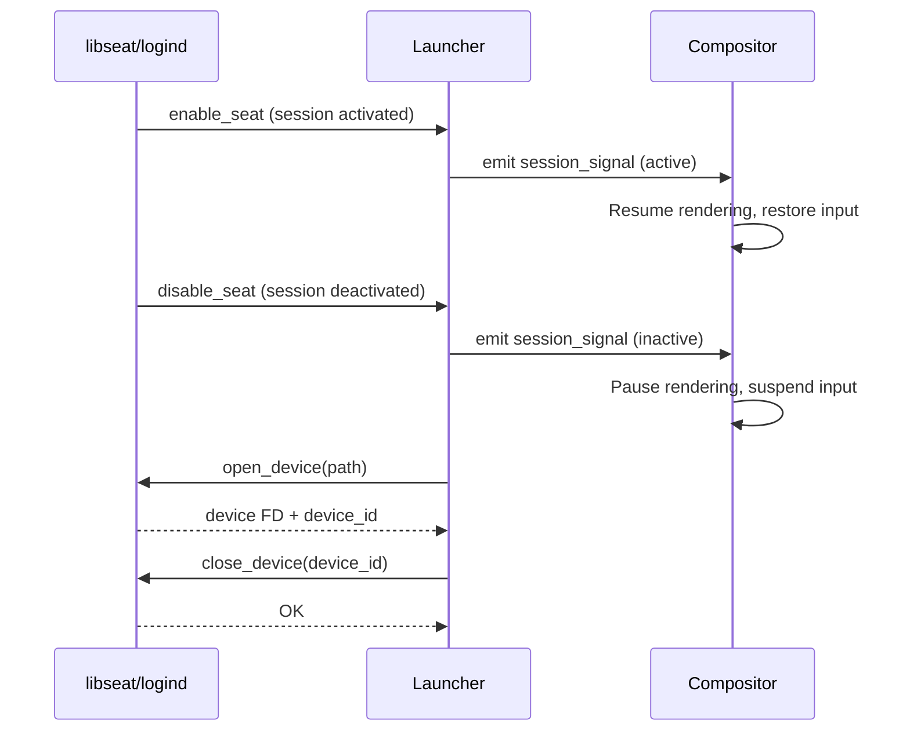
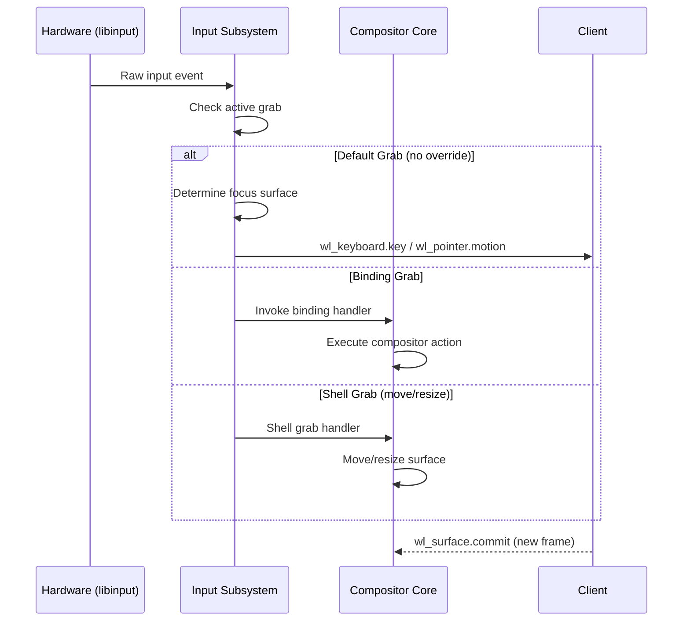
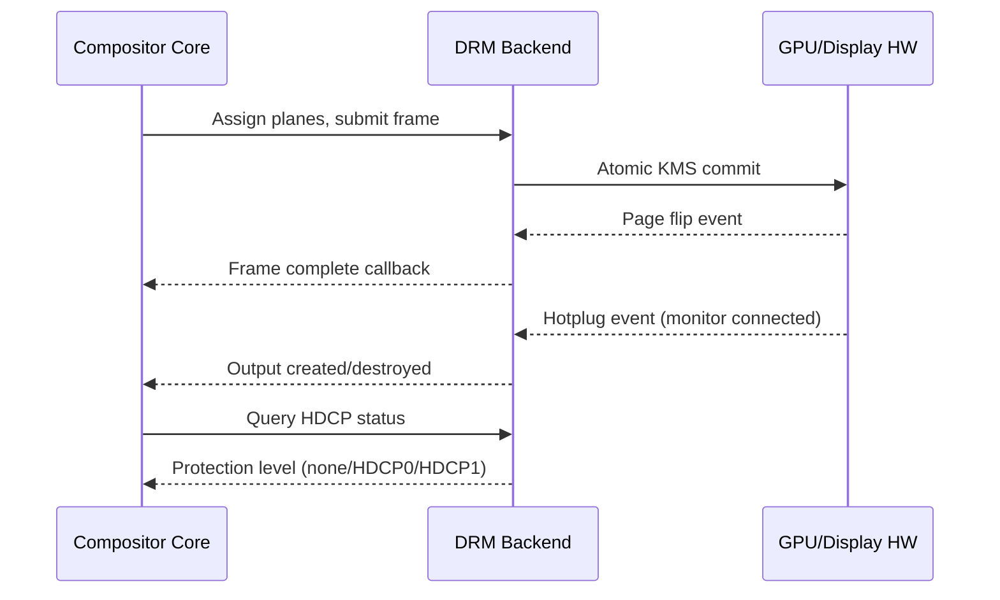
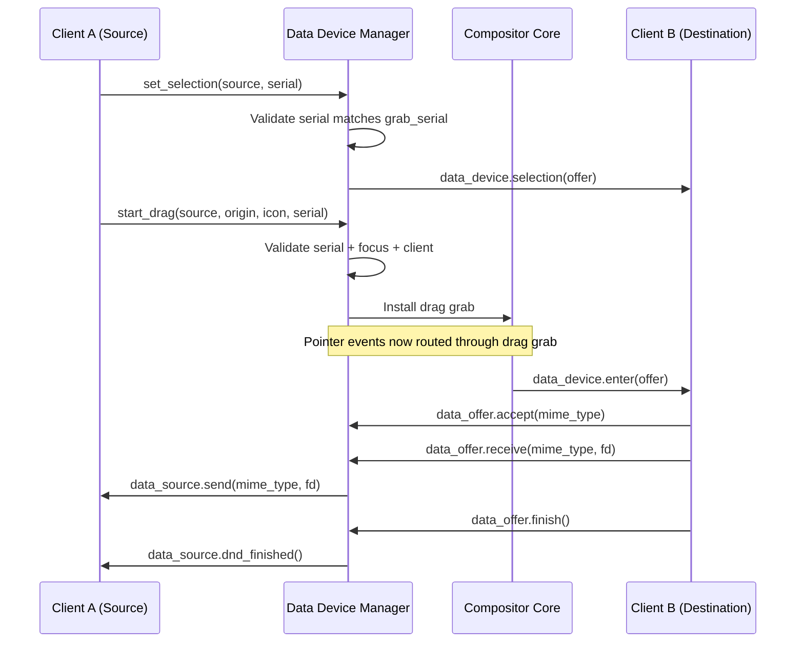
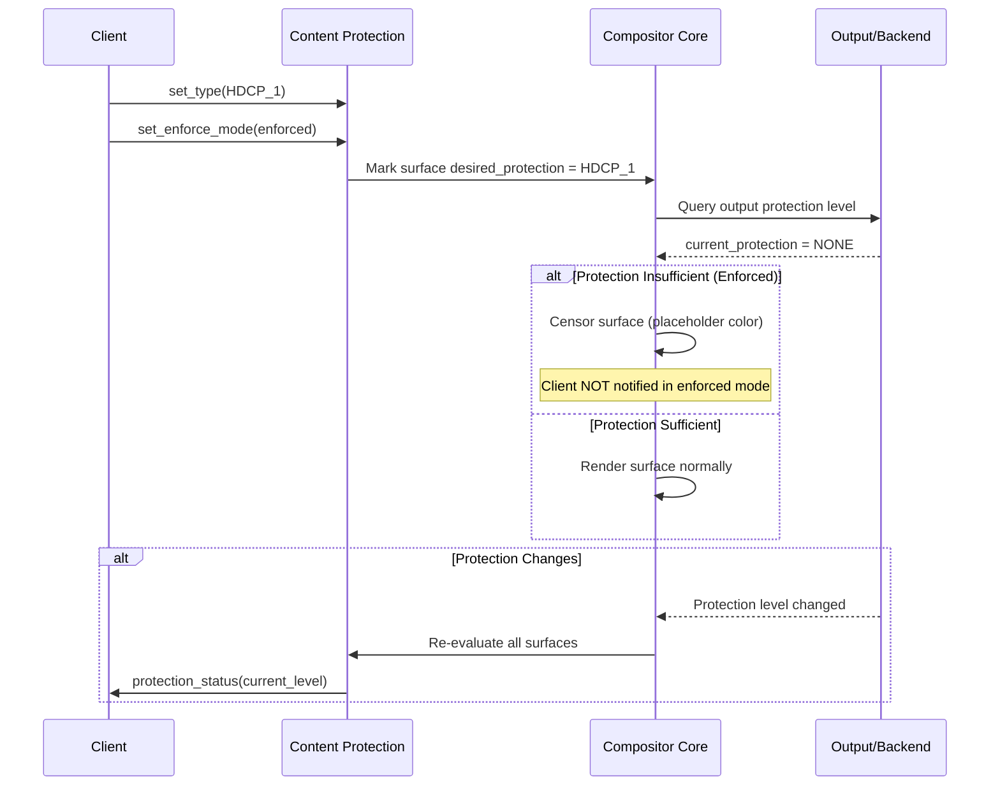

# STPA Control Structure - Weston Compositor

## 1. Hierarchical Control Structure

The following diagram shows the complete hierarchical control structure of the Weston
compositor system, including all controllers, controlled processes, control actions
(downward arrows), and feedback (upward arrows).

```mermaid
graph TB
    subgraph External["External Environment"]
        ADMIN["System Administrator"]
        USER["End User<br/>(Physical Input Devices)"]
        DISPLAY["Display Hardware<br/>(Monitors, GPUs)"]
    end

    subgraph SessionMgmt["Session Management Layer"]
        LIBSEAT["libseat / systemd-logind<br/><i>Session Manager</i>"]
    end

    subgraph WestonFrontend["Weston Frontend Process"]
        FRONTEND["weston binary<br/>(frontend/main.c)"]
    end

    subgraph LibwestonCore["libweston Compositor Core"]
        COMPOSITOR["Compositor Core<br/>(compositor.c)"]
        INPUT["Input Subsystem<br/>(input.c, bindings.c)"]
        DATADEV["Data Device Manager<br/>(data-device.c)"]
        CONTENTPROT["Content Protection<br/>(content-protection.c)"]
        LAUNCHER["Launcher<br/>(launcher-util.c)"]
    end

    subgraph Backends["Backend Layer"]
        DRM["DRM/KMS Backend<br/>(backend-drm/)"]
        WLBACKEND["Wayland Backend<br/>(backend-wayland/)"]
        X11["X11 Backend<br/>(backend-x11/)"]
        VNC["VNC Backend<br/>(backend-vnc/)"]
        RDP["RDP Backend<br/>(backend-rdp/)"]
    end

    subgraph Renderers["Rendering Layer"]
        GL["GL Renderer<br/>(renderer-gl/)"]
        PIXMAN["Pixman Renderer<br/>(pixman-renderer.c)"]
        VULKAN["Vulkan Renderer<br/>(renderer-vulkan/)"]
    end

    subgraph Shells["Shell Plugins"]
        DESKTOP["Desktop Shell<br/>(desktop-shell/)"]
        KIOSK["Kiosk Shell<br/>(kiosk-shell/)"]
        IVI["IVI Shell<br/>(ivi-shell/)"]
        FULLSCREEN["Fullscreen Shell<br/>(fullscreen-shell/)"]
    end

    subgraph Clients["Wayland Client Applications"]
        CLIENT_A["Client A"]
        CLIENT_B["Client B"]
        CLIENT_N["Client N..."]
    end

    %% Control Actions (downward)
    ADMIN -->|"configure, start/stop"| FRONTEND
    ADMIN -->|"session policy"| LIBSEAT
    USER -->|"physical input events"| INPUT

    LIBSEAT -->|"grant/revoke device FD"| LAUNCHER
    LIBSEAT -->|"enable/disable session"| LAUNCHER

    FRONTEND -->|"load config, init compositor"| COMPOSITOR
    FRONTEND -->|"select backend, shell"| COMPOSITOR

    COMPOSITOR -->|"set focus, route events"| INPUT
    COMPOSITOR -->|"assign surfaces to outputs"| DRM
    COMPOSITOR -->|"assign surfaces to outputs"| WLBACKEND
    COMPOSITOR -->|"render frame"| GL
    COMPOSITOR -->|"render frame"| PIXMAN
    COMPOSITOR -->|"manage surfaces"| DESKTOP
    COMPOSITOR -->|"enforce protection"| CONTENTPROT
    COMPOSITOR -->|"manage transfers"| DATADEV

    LAUNCHER -->|"open/close device"| DRM

    INPUT -->|"deliver wl_keyboard/pointer/touch events"| CLIENT_A
    INPUT -->|"deliver wl_keyboard/pointer/touch events"| CLIENT_B
    DATADEV -->|"data_offer, selection events"| CLIENT_A
    DATADEV -->|"data_offer, selection events"| CLIENT_B
    CONTENTPROT -->|"protection_status events"| CLIENT_A

    DESKTOP -->|"configure, position surfaces"| COMPOSITOR
    KIOSK -->|"configure surfaces"| COMPOSITOR

    %% Feedback (upward)
    CLIENT_A -->|"wl_surface.commit, requests"| COMPOSITOR
    CLIENT_B -->|"wl_surface.commit, requests"| COMPOSITOR
    CLIENT_A -->|"set_selection, start_drag"| DATADEV
    CLIENT_A -->|"set_content_type"| CONTENTPROT

    DRM -->|"page flip complete, HDCP status"| COMPOSITOR
    GL -->|"frame rendered"| COMPOSITOR
    PIXMAN -->|"frame rendered"| COMPOSITOR

    DISPLAY -->|"hotplug, EDID, DPMS"| DRM
    LAUNCHER -->|"session active/inactive"| COMPOSITOR

    INPUT -->|"grab state, focus state"| COMPOSITOR

    style External fill:#f9f9f9,stroke:#999
    style SessionMgmt fill:#e8f4e8,stroke:#4a4
    style WestonFrontend fill:#e8e8f4,stroke:#44a
    style LibwestonCore fill:#f4e8e8,stroke:#a44
    style Backends fill:#f4f4e8,stroke:#aa4
    style Renderers fill:#e8f4f4,stroke:#4aa
    style Shells fill:#f4e8f4,stroke:#a4a
    style Clients fill:#f0f0f0,stroke:#888
```

---

## 2. Control Actions and Feedback Detail

### 2.1 Session Manager -> Launcher

**Control Actions (Session Manager -> Launcher):**
- `enable_seat`: Grant session control to compositor
- `disable_seat`: Revoke session control (VT switch away)
- Device FD grant/revoke

**Feedback (Launcher -> Session Manager):**
- Device open/close requests
- VT switch requests (`activate_vt`)

---

### 2.2 Compositor Core -> Input Subsystem

**Control Actions (Compositor -> Input):**
- `weston_keyboard_set_focus(surface)`: Direct keyboard events to surface
- `weston_pointer_set_focus(surface)`: Direct pointer events to surface
- `weston_*_start_grab(grab)`: Install event interceptor
- `weston_*_end_grab()`: Remove event interceptor

**Feedback (Input -> Compositor):**
- Focus change signals (`keyboard_focus_signal`, `pointer_focus_signal`)
- Grab state transitions
- Binding matches

---

### 2.3 Compositor Core -> Backend (DRM)

**Control Actions (Compositor -> DRM Backend):**
- Plane assignment and Z-ordering
- KMS atomic commit (framebuffers to CRTCs)
- Output enable/disable
- DPMS state control

**Feedback (DRM Backend -> Compositor):**
- Page flip completion
- Hotplug events
- HDCP/protection status
- Page flip timeout (stuck driver detection)

---

### 2.4 Data Device Manager Control Flow

**Control Actions:**
- Serial validation gates drag/selection initiation
- Grab installation controls event routing during drag
- Offer/accept negotiation controls data flow

**Feedback:**
- Client acceptance/rejection of mime types
- Drag motion updates (enter/leave/motion events)
- Transfer completion signals

---

### 2.5 Content Protection Control Flow

---

## 3. Trust Boundaries

```mermaid
graph TB
    subgraph TB_Kernel["TRUST BOUNDARY: Kernel Space"]
        KMS["KMS/DRM Driver"]
        EVDEV["evdev Input Driver"]
        LOGIND["systemd-logind"]
    end

    subgraph TB_Privileged["TRUST BOUNDARY: Privileged Session"]
        LIBSEAT_P["libseat"]
        LAUNCHER_P["Launcher"]
    end

    subgraph TB_Compositor["TRUST BOUNDARY: Compositor Process"]
        COMP["Compositor Core"]
        SHELL_P["Shell Plugin<br/>(in-process)"]
        BACKEND_P["Backend<br/>(in-process)"]
        RENDERER_P["Renderer<br/>(in-process)"]
    end

    subgraph TB_Client_A["TRUST BOUNDARY: Client A Process"]
        CLA["Client A<br/>(separate process)"]
    end

    subgraph TB_Client_B["TRUST BOUNDARY: Client B Process"]
        CLB["Client B<br/>(separate process)"]
    end

    KMS <-->|"ioctl, mmap"| BACKEND_P
    EVDEV <-->|"libinput"| COMP
    LOGIND <-->|"D-Bus"| LIBSEAT_P
    LIBSEAT_P <-->|"FD passing"| LAUNCHER_P
    LAUNCHER_P <-->|"internal API"| COMP

    CLA <-->|"Unix socket<br/>(Wayland protocol)"| COMP
    CLB <-->|"Unix socket<br/>(Wayland protocol)"| COMP

    CLA x--x CLB

    style TB_Kernel fill:#ffe0e0,stroke:#c00
    style TB_Privileged fill:#fff0e0,stroke:#c80
    style TB_Compositor fill:#e0ffe0,stroke:#0c0
    style TB_Client_A fill:#e0e0ff,stroke:#00c
    style TB_Client_B fill:#e0e0ff,stroke:#00c
```

**Key Trust Boundaries:**

| Boundary | Mechanism | What Crosses |
|----------|-----------|-------------|
| Kernel <-> Compositor | ioctl, FD passing | Device FDs, DRM framebuffers, input events |
| logind <-> libseat | D-Bus | Session state, device authorization |
| Compositor <-> Client | Unix domain socket (Wayland) | Protocol messages, buffer FDs, input events |
| Client A <-> Client B | **No direct crossing** | Isolated by process separation; compositor mediates |

**In-Process (No Boundary):**
- Shell plugins run inside the compositor process (full trust)
- Backends run inside the compositor process
- Renderers run inside the compositor process

This is a critical architectural property: a malicious or buggy shell plugin can compromise
the entire compositor because there is no process isolation between them.
