# STPA Step 2: Unsafe Control Actions (UCAs)

This document identifies Unsafe Control Actions for each controller in the Weston
compositor control structure. An UCA is a control action that, in a particular context
and worst-case environment, leads to a hazard.

## UCA Classification Guide

UCAs are classified into four types:
1. **Not providing** the control action leads to a hazard
2. **Providing** the control action leads to a hazard
3. **Too early, too late, or out of order**
4. **Stopped too soon or applied too long**

---

## 1. Controller: Compositor Core

### CA-1: Set Keyboard Focus (`weston_keyboard_set_focus`)

| UCA ID | Type | Unsafe Control Action | Hazard |
|--------|------|-----------------------|--------|
| UCA-1.1 | Not providing | Compositor does not set keyboard focus to any surface after user clicks on a window | H-1: User types credentials into wrong application |
| UCA-1.2 | Providing | Compositor sets keyboard focus to a background/hidden surface while user interacts with foreground | H-1: Keystrokes captured by unintended client |
| UCA-1.3 | Too late | Compositor sets keyboard focus after a delay, during which keystrokes are delivered to the previously focused surface | H-1, H-2: Input leaks to wrong client |
| UCA-1.4 | Stopped too soon | Compositor clears keyboard focus during active typing (no surface focused) | H-10: Events dropped, user perceives DoS |

### CA-2: Set Pointer Focus (`weston_pointer_set_focus`)

| UCA ID | Type | Unsafe Control Action | Hazard |
|--------|------|-----------------------|--------|
| UCA-2.1 | Not providing | Compositor does not update pointer focus when pointer moves to a new surface | H-1: Click events go to wrong client |
| UCA-2.2 | Providing | Compositor sets pointer focus to an obscured surface beneath the visible one | H-1, H-2: User interacts with hidden application |
| UCA-2.3 | Too late | Pointer focus update lags behind actual pointer position during fast motion | H-1: Click dispatched to stale focus surface |

### CA-3: Install Grab (`weston_pointer_start_grab`, `weston_keyboard_start_grab`)

| UCA ID | Type | Unsafe Control Action | Hazard |
|--------|------|-----------------------|--------|
| UCA-3.1 | Providing | Compositor installs a grab for a client that did not initiate the interaction (invalid serial) | H-4: Unauthorized event interception |
| UCA-3.2 | Not providing | Compositor fails to install grab for shell move/resize, allowing events to leak to underlying surface | H-2: Input misdirected |
| UCA-3.3 | Stopped too soon | Grab released before operation completes (e.g., during drag), events route to wrong surface | H-4, H-8: Data directed to wrong client |
| UCA-3.4 | Applied too long | Grab persists after initiating client crashes, blocking all input to other surfaces | H-10: Input DoS |

### CA-4: Assign Surface to Output

| UCA ID | Type | Unsafe Control Action | Hazard |
|--------|------|-----------------------|--------|
| UCA-4.1 | Providing | Compositor assigns a protected surface to an unprotected output | H-6: Content protection bypass |
| UCA-4.2 | Not providing | Compositor fails to assign surface to any output after hotplug | H-10: Surface invisible, appears as DoS |

### CA-5: Render Frame

| UCA ID | Type | Unsafe Control Action | Hazard |
|--------|------|-----------------------|--------|
| UCA-5.1 | Providing | Compositor renders frame containing a protected surface without censoring on unprotected output | H-6: HDCP bypass |
| UCA-5.2 | Too late | Frame rendered after deadline, causing visual glitch or missed VBlank | H-10: Perceived DoS |
| UCA-5.3 | Not providing | Compositor stops rendering while session is active | H-10: Frozen display |

---

## 2. Controller: Input Subsystem

### CA-6: Deliver Input Event to Client

| UCA ID | Type | Unsafe Control Action | Hazard |
|--------|------|-----------------------|--------|
| UCA-6.1 | Providing | Input event delivered to client that does not have focus | H-1, H-2: Input leak |
| UCA-6.2 | Not providing | Input event not delivered to focused client (consumed by stale grab) | H-10: Apparent input DoS |
| UCA-6.3 | Too late | Input event delivered with excessive latency | H-10: Degraded responsiveness |
| UCA-6.4 | Applied too long | Key repeat continues after focus change, flooding new focus surface | H-2: Unintended input to new surface |

### CA-7: Invoke Binding Handler

| UCA ID | Type | Unsafe Control Action | Hazard |
|--------|------|-----------------------|--------|
| UCA-7.1 | Not providing | VT-switch binding (Ctrl-Alt-F*) not triggered, trapping user in compositor | H-10: Cannot escape to another session |
| UCA-7.2 | Providing | Binding invoked for key combination intended for client | H-2: Client misses intended input |

---

## 3. Controller: Launcher / libseat

### CA-8: Open Device (`libseat_open_device`)

| UCA ID | Type | Unsafe Control Action | Hazard |
|--------|------|-----------------------|--------|
| UCA-8.1 | Providing | Device FD opened for session that is no longer active | H-3: Privilege escalation via stale FD |
| UCA-8.2 | Not providing | Device FD not opened when session becomes active | H-10: No display output |
| UCA-8.3 | Too late | Device FD delivered after backend has timed out waiting | H-10: Backend initialization failure |

### CA-9: Enable/Disable Session

| UCA ID | Type | Unsafe Control Action | Hazard |
|--------|------|-----------------------|--------|
| UCA-9.1 | Not providing | Session not disabled on VT switch away | H-6: Compositor continues rendering to hardware owned by other session |
| UCA-9.2 | Providing | Session disabled while compositor is in middle of atomic commit | H-10: Stuck KMS state |
| UCA-9.3 | Too late | Session enable delivered after user has begun typing in new session | H-1: Input captured by wrong session |

---

## 4. Controller: Shell Plugin

### CA-10: Configure Surface Position/Size

| UCA ID | Type | Unsafe Control Action | Hazard |
|--------|------|-----------------------|--------|
| UCA-10.1 | Providing | Shell positions surface to cover security-critical UI (e.g., auth dialog) | H-1, H-2: UI spoofing |
| UCA-10.2 | Not providing | Shell does not position surface, leaving it at (0,0) overlapping other surfaces | H-1: Confusing Z-order |

### CA-11: Activate/Deactivate Surface

| UCA ID | Type | Unsafe Control Action | Hazard |
|--------|------|-----------------------|--------|
| UCA-11.1 | Providing | Shell activates a surface from a background client without user intent | H-1: Focus stealing |
| UCA-11.2 | Not providing | Shell fails to activate surface on user click | H-10: Apparent unresponsiveness |

---

## 5. Controller: Data Device Manager

### CA-12: Process Selection Set (`set_selection`)

| UCA ID | Type | Unsafe Control Action | Hazard |
|--------|------|-----------------------|--------|
| UCA-12.1 | Providing | Selection set accepted with invalid serial (not from recent input event) | H-8: Clipboard hijacking |
| UCA-12.2 | Not providing | Valid selection set rejected, clipboard becomes stale | H-7: Data integrity loss |

### CA-13: Process Drag Start (`start_drag`)

| UCA ID | Type | Unsafe Control Action | Hazard |
|--------|------|-----------------------|--------|
| UCA-13.1 | Providing | Drag initiated by client that doesn't own the pointer focus | H-4, H-8: Unauthorized DnD |
| UCA-13.2 | Stopped too soon | Drag cancelled mid-transfer, leaving destination with partial data | H-7: Data corruption |

---

## 6. Controller: Content Protection Manager

### CA-14: Censor Protected Surface

| UCA ID | Type | Unsafe Control Action | Hazard |
|--------|------|-----------------------|--------|
| UCA-14.1 | Not providing | Protected surface not censored when output protection drops | H-6: Content exposed |
| UCA-14.2 | Too late | Censoring applied after one or more frames rendered unprotected | H-6: Transient content leak |
| UCA-14.3 | Providing | Surface censored when output protection is actually sufficient | H-10: False positive, content invisible to authorized user |

---

## 7. UCA Summary Heatmap

```mermaid
graph LR
    subgraph UCAs["Unsafe Control Actions by Hazard"]
        direction TB
        H1["H-1: Unauthorized Focus<br/>UCA-1.1, 1.2, 1.3, 2.1, 2.2, 2.3,<br/>6.1, 9.3, 10.1, 11.1"]
        H2["H-2: Buffer Disclosure<br/>UCA-1.2, 2.2, 3.2, 6.1, 6.4, 7.2, 10.1"]
        H3["H-3: Device FD Leak<br/>UCA-8.1"]
        H4["H-4: Grab Exploit<br/>UCA-3.1, 3.3, 13.1"]
        H5["H-5: Session Sync<br/>UCA-9.1, 9.2"]
        H6["H-6: Content Prot. Bypass<br/>UCA-4.1, 5.1, 9.1, 14.1, 14.2"]
        H7["H-7: Data Integrity<br/>UCA-12.2, 13.2"]
        H8["H-8: Cross-Boundary Data<br/>UCA-3.3, 12.1, 13.1"]
        H10["H-10: Denial of Service<br/>UCA-1.4, 3.4, 4.2, 5.2, 5.3,<br/>6.2, 6.3, 7.1, 8.2, 8.3,<br/>9.2, 11.2, 14.3"]
    end

    style H1 fill:#ff6666,stroke:#c00,color:#fff
    style H2 fill:#ff6666,stroke:#c00,color:#fff
    style H3 fill:#ff9933,stroke:#c60,color:#fff
    style H4 fill:#ff6666,stroke:#c00,color:#fff
    style H5 fill:#ff9933,stroke:#c60,color:#fff
    style H6 fill:#ff6666,stroke:#c00,color:#fff
    style H7 fill:#ffcc00,stroke:#990,color:#000
    style H8 fill:#ff9933,stroke:#c60,color:#fff
    style H10 fill:#ff9933,stroke:#c60,color:#fff
```

---

## 8. UCA Count by Controller

| Controller | # UCAs | Highest Severity Hazard |
|-----------|--------|------------------------|
| Compositor Core | 11 | H-1, H-6 (Information Disclosure, Content Protection) |
| Input Subsystem | 5 | H-1, H-2 (Information Disclosure) |
| Launcher/libseat | 5 | H-3 (Privilege Escalation) |
| Shell Plugin | 4 | H-1 (Focus Stealing / UI Spoofing) |
| Data Device Manager | 4 | H-8 (Cross-Boundary Data Leak) |
| Content Protection | 3 | H-6 (Content Protection Bypass) |
| **Total** | **32** | |
