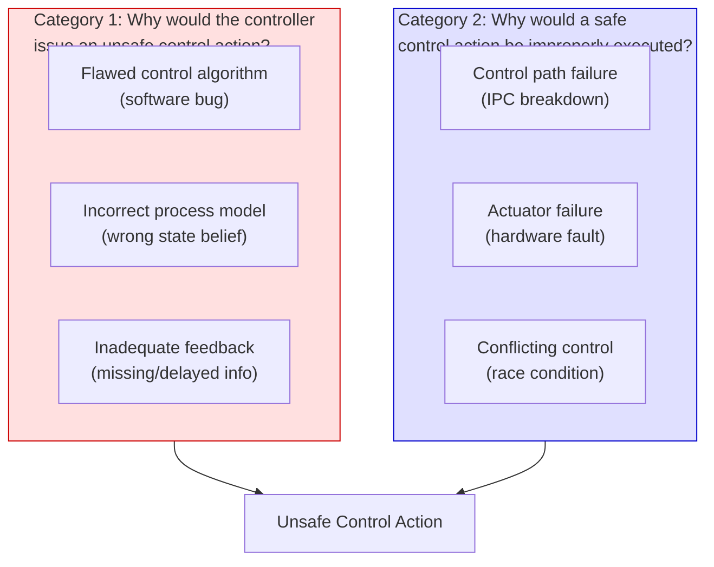
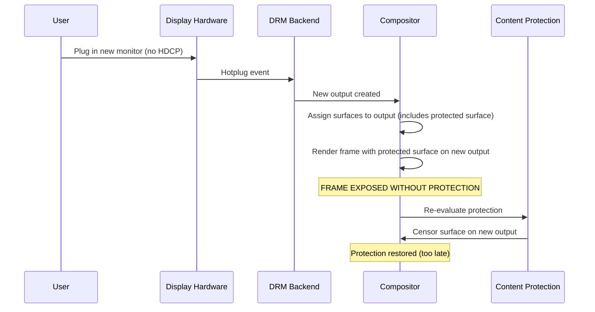
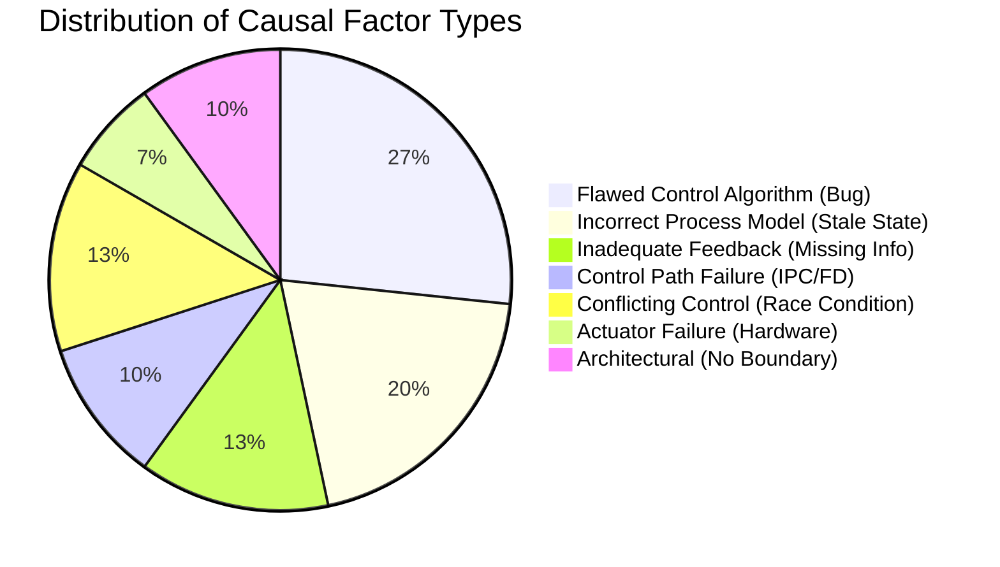

# STPA Step 3: Loss Scenarios and Causal Factors

This document identifies specific scenarios that could lead to each Unsafe Control
Action (UCA), examining the causal factors within Weston's implementation.

---

## 1. Causal Factor Categories

STPA identifies two main categories of causal factors:

---

## 2. Loss Scenarios by Hazard

### LS-1: Input Focus Misdirection (H-1)

#### Scenario LS-1.1: Race Between Surface Destruction and Focus Assignment

**Related UCAs:** UCA-1.2, UCA-1.3

**Scenario:** A client application crashes while it holds keyboard focus. The compositor
receives the `wl_client` destroy notification and begins cleanup. Simultaneously, the
shell plugin attempts to restore focus to the next surface in the workspace focus list.
If the focus restoration reads a stale `focus_state` entry pointing to the destroyed
surface before the cleanup completes, keyboard events may be briefly routed to a null
or recycled surface.

**Causal Factors:**
- **Incorrect process model:** Shell's focus_state list contains stale entry for destroyed surface
- **Conflicting control:** Destroy handler and focus restoration execute concurrently on same event loop iteration
- **Code location:** `desktop-shell/shell.c` `restore_focus_state()` vs `compositor.c` surface destroy handler

**Weston Mitigation:** Destroy listeners on `focus_state` clear entries before reuse. However, there is a window during the same event loop iteration where multiple signals fire.

---

#### Scenario LS-1.2: Subsurface Z-Order Obscures Focus Target

**Related UCAs:** UCA-2.2, UCA-10.1

**Scenario:** Client A creates a subsurface that overlaps Client B's surface. The
compositor's focus determination uses `weston_compositor_pick_view()` which iterates
the view list in Z-order. If a transparent or input-region-empty subsurface of Client A
is placed above Client B but does not properly set its input region, the compositor may
grant pointer focus to Client A's subsurface instead of Client B's visible surface.

**Causal Factors:**
- **Flawed control algorithm:** `pick_view` does not verify input region is non-empty before selecting
- **Incorrect process model:** Compositor believes subsurface is interactive because it's in the view list
- **Code location:** `compositor.c` `weston_compositor_pick_view()`, `surface_set_input_region()`

---

#### Scenario LS-1.3: Focus Stealing via Rapid Surface Mapping

**Related UCAs:** UCA-11.1

**Scenario:** A malicious client rapidly maps and unmaps surfaces, triggering the shell's
`map` handler which calls `activate()`. Each activation sets keyboard focus. If the shell
does not rate-limit or validate activation requests, the client can steal focus from the
user's intended surface at any time.

**Causal Factors:**
- **Flawed control algorithm:** Shell `map` handler unconditionally activates new surfaces
- **Missing feedback:** No mechanism for user to indicate "do not switch focus"
- **Code location:** `desktop-shell/shell.c` `map()` -> `activate()`

---

### LS-2: Buffer Content Disclosure (H-2)

#### Scenario LS-2.1: Screenshot Captures Protected Surface

**Related UCAs:** UCA-5.1, UCA-14.1

**Scenario:** A client requests a screenshot via the `weston-output-capture` protocol.
The compositor renders all visible surfaces into a capture buffer. If a protected surface
(with content-protection set) is visible and the capture path does not apply the same
censoring logic as the render path, the protected content is captured in plaintext.

**Causal Factors:**
- **Flawed control algorithm:** Output capture path bypasses content protection censoring
- **Code location:** `libweston/output-capture.c`, `libweston/content-protection.c`

---

#### Scenario LS-2.2: Shared GL Context Leaks Texture Data

**Related UCAs:** UCA-5.1

**Scenario:** The GL renderer uses a single EGL context for all client surfaces. If a
malicious backend or renderer extension can read textures from the shared context, it
could access another client's buffer contents. While clients cannot directly access the
GL context, a compromised in-process shell plugin could.

**Causal Factors:**
- **Actuator failure:** No GPU-level isolation between client textures
- **Architectural:** Shell plugins share process with renderer (no trust boundary)

---

### LS-3: Privilege Escalation via Device FD (H-3)

#### Scenario LS-3.1: Stale Device FD After Session Switch

**Related UCAs:** UCA-8.1, UCA-9.1

**Scenario:** On VT switch, `handle_disable_seat()` signals the compositor to pause.
The compositor pauses rendering but does not immediately close all device FDs obtained
from libseat. If the compositor process (or a forked child) retains the open DRM device
FD, it can continue issuing `ioctl()` calls against hardware now owned by another session.

**Causal Factors:**
- **Stopped too soon:** Session disable does not force-close all device FDs
- **Inadequate feedback:** libseat revokes access at kernel level (DRM master drop), but compositor may cache the FD
- **Code location:** `libweston/launcher-libseat.c` `handle_disable_seat()`, `backend-drm/drm.c`

**Weston Mitigation:** DRM master is dropped by the kernel on session switch, preventing most dangerous ioctls. However, some read operations may still succeed on the stale FD.

---

#### Scenario LS-3.2: XWayland Inherits Device FDs

**Related UCAs:** UCA-8.1

**Scenario:** When Weston spawns XWayland, the child process may inherit open file
descriptors if `CLOEXEC` is not set on all device FDs. XWayland runs with different
privileges and could use inherited DRM device FDs.

**Causal Factors:**
- **Control path failure:** FD inheritance across fork/exec boundary
- **Code location:** `xwayland/`, device FD creation in launcher

**Weston Mitigation:** `CLOEXEC` is typically set, but verification is not enforced by a central mechanism.

---

### LS-4: Grab Exploitation (H-4)

#### Scenario LS-4.1: Serial Prediction for Drag Initiation

**Related UCAs:** UCA-3.1, UCA-13.1

**Scenario:** The Wayland protocol uses 32-bit serials to correlate input events with
client requests. A malicious client can observe serials from its own input events and
predict the serial of the next input event (serials are sequential). It then issues a
`start_drag` with the predicted serial. If the prediction is correct and the client
happens to have pointer focus at that instant, the drag grab is installed.

**Causal Factors:**
- **Flawed control algorithm:** Sequential serial allocation is predictable
- **Inadequate feedback:** No mechanism to detect serial prediction/replay
- **Code location:** `libweston/data-device.c` serial validation in `start_drag`

**Weston Mitigation:** The serial must match `pointer->grab_serial` which is set on button press. The client must have focus and the serial must match exactly, which limits the attack window.

---

#### Scenario LS-4.2: Orphaned Grab After Client Crash

**Related UCAs:** UCA-3.4

**Scenario:** Client A initiates a pointer grab (e.g., via `start_drag`). Before the
grab completes, Client A crashes. The grab structure references memory associated with
the destroyed client. Subsequent pointer events dispatched through the grab access freed
memory (use-after-free).

**Causal Factors:**
- **Control path failure:** Client destroy handler does not cancel active grabs
- **Incorrect process model:** Grab holds dangling reference to destroyed client's resources
- **Code location:** `libweston/input.c` grab lifecycle, `data-device.c` drag grab

**Weston Mitigation:** Destroy listeners on wl_resource trigger grab cancellation. However, the ordering of destroy handlers across multiple subsystems can create windows.

---

### LS-5: Content Protection Bypass (H-6)

#### Scenario LS-5.1: Output Hotplug Race

**Related UCAs:** UCA-14.1, UCA-14.2

**Scenario:** A protected surface is being rendered on Output A (HDCP enabled). The user
hot-plugs Output B (no HDCP). The compositor detects the hotplug and extends the desktop
to Output B. If the surface is moved/extended to Output B before the content protection
re-evaluation occurs, one or more frames of protected content render on the unprotected
output.

**Causal Factors:**
- **Too late:** Content protection check runs after output assignment
- **Incorrect process model:** Compositor assumes all outputs have same protection level during frame
- **Code location:** `libweston/content-protection.c` re-evaluation path, `backend-drm/drm.c` hotplug handler

---

#### Scenario LS-5.2: Placeholder Color Matches Content

**Related UCAs:** UCA-14.1

**Scenario:** When content is censored, Weston replaces it with a placeholder solid color
(`compositor->placeholder_color`). If this color happens to match or closely resemble the
protected content (e.g., a solid-color UI element), the censoring provides no visual
indication that protection is active, and the "censored" output is indistinguishable from
real content to an observer.

**Causal Factors:**
- **Flawed control algorithm:** Censoring uses a single static color with no scramble/pattern

---

### LS-6: Denial of Service (H-10)

#### Scenario LS-6.1: Input Event Flood

**Related UCAs:** UCA-6.3, UCA-5.2

**Scenario:** A hardware device (or compromised libinput) generates an extremely high
rate of input events (e.g., a malfunctioning touchscreen sending thousands of touch events
per second). The compositor's single-threaded event loop processes each event synchronously,
starving frame rendering and protocol dispatch.

**Causal Factors:**
- **No rate limiting:** Input events processed without throttling
- **Architectural:** Single event loop for input + rendering + protocol
- **Code location:** `libweston/input.c` event dispatch, `compositor.c` event loop

---

#### Scenario LS-6.2: Malicious Client Surface Commit Storm

**Related UCAs:** UCA-5.2, UCA-5.3

**Scenario:** A client commits surfaces at an extremely high rate (thousands of
`wl_surface.commit` per second) with complex buffer contents. Each commit triggers
damage tracking, repaint scheduling, and potentially GPU operations. The compositor
spends all its time processing commits and never completes a frame.

**Causal Factors:**
- **No rate limiting:** No per-client commit rate limit
- **Conflicting control:** Multiple clients competing for compositor event loop time

---

#### Scenario LS-6.3: KMS Page Flip Timeout

**Related UCAs:** UCA-5.3

**Scenario:** The DRM backend submits an atomic KMS commit, but the GPU driver never
signals page flip completion. The compositor waits indefinitely for the flip event,
unable to render new frames.

**Causal Factors:**
- **Actuator failure:** GPU driver bug
- **Inadequate feedback:** No timeout mechanism triggers recovery
- **Code location:** `backend-drm/drm.c` page flip timeout handling

**Weston Mitigation:** Weston has a page flip timeout mechanism that detects stuck flips, but recovery may still leave the display frozen temporarily.

---

### LS-7: Data Integrity via Clipboard (H-7, H-8)

#### Scenario LS-7.1: Clipboard Sniffing

**Related UCAs:** UCA-12.1

**Scenario:** When Client A sets the selection (clipboard), all clients with keyboard
focus capability receive a `data_device.selection` event containing the available mime
types. Any focused client can then request the actual data. A background client that
previously had focus and retains a `wl_data_device` resource can observe clipboard
changes, even though it is not the active window.

**Causal Factors:**
- **Flawed control algorithm:** Selection events broadcast to all clients with data_device resources
- **Incorrect process model:** Compositor treats all data_device holders as authorized recipients
- **Code location:** `libweston/data-device.c` selection broadcast

---

#### Scenario LS-7.2: Drag-and-Drop Target Mismatch

**Related UCAs:** UCA-13.2, UCA-3.3

**Scenario:** During a drag-and-drop operation, the user moves the pointer rapidly from
Client A's surface to Client B's surface and releases the button. Due to input event
batching, the compositor processes the motion and button release in the same event loop
iteration. The drag focus may not have been updated to Client B before the drop occurs,
causing the data to be delivered to Client A (the stale drag focus).

**Causal Factors:**
- **Too late:** Focus update and drop processed in wrong order within same event loop tick
- **Code location:** `libweston/data-device.c` drag grab handlers

---

## 3. Causal Factor Summary

---

## 4. Scenario Risk Matrix

| Scenario | Likelihood | Impact | Risk | Primary Causal Factor |
|----------|-----------|--------|------|----------------------|
| LS-1.1: Race on surface destroy | Medium | High | **High** | Race condition |
| LS-1.2: Subsurface Z-order trick | Low | Medium | **Medium** | Algorithm flaw |
| LS-1.3: Focus steal via rapid map | Medium | High | **High** | Missing rate limit |
| LS-2.1: Screenshot captures protected | Low | Critical | **High** | Missing check in capture path |
| LS-2.2: GL texture leak via plugin | Low | Critical | **High** | No process isolation |
| LS-3.1: Stale FD after VT switch | Low | Critical | **High** | Incomplete cleanup |
| LS-3.2: XWayland FD inheritance | Very Low | Critical | **Medium** | CLOEXEC gap |
| LS-4.1: Serial prediction | Very Low | High | **Low** | Sequential serials |
| LS-4.2: Orphaned grab UAF | Low | Critical | **High** | Destroy ordering |
| LS-5.1: Hotplug protection race | Medium | High | **High** | Missing atomic check |
| LS-5.2: Placeholder color match | Low | Low | **Low** | Design limitation |
| LS-6.1: Input event flood | Medium | Medium | **Medium** | No rate limiting |
| LS-6.2: Client commit storm | Medium | Medium | **Medium** | No rate limiting |
| LS-6.3: KMS flip timeout | Low | High | **Medium** | Driver dependency |
| LS-7.1: Clipboard sniffing | High | Medium | **High** | Broadcast design |
| LS-7.2: DnD target mismatch | Low | Medium | **Low** | Event batching |
