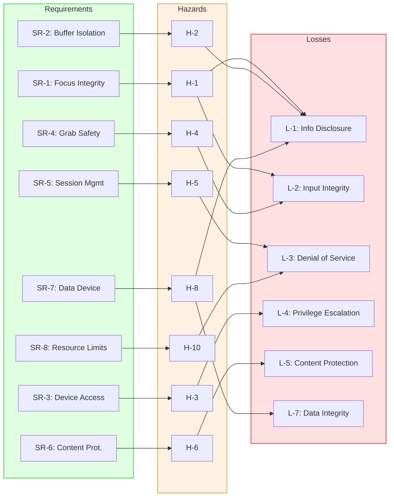
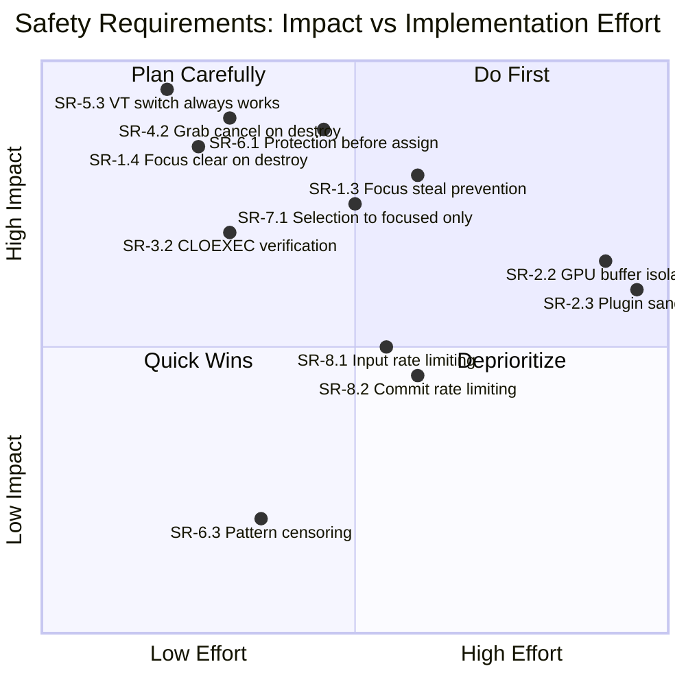

# STPA Step 4: Safety Requirements and Constraints

This document derives safety requirements from the identified Unsafe Control Actions
(UCAs) and Loss Scenarios, and maps them to specific Weston components.

---

## 1. Derived Safety Requirements

### SR-1: Input Focus Integrity

| Req ID | Requirement | Derived From | Priority |
|--------|-------------|-------------|----------|
| SR-1.1 | The compositor SHALL validate that a surface is mapped, visible, and in the top-most interactive position before granting it keyboard focus | UCA-1.2, LS-1.2 | High |
| SR-1.2 | Focus transitions SHALL be atomic: no input events SHALL be dispatched during a focus change operation | UCA-1.3, LS-1.1 | High |
| SR-1.3 | The shell SHALL implement focus-stealing prevention: new surfaces SHALL NOT receive keyboard focus without explicit user interaction (click, keyboard shortcut) | UCA-11.1, LS-1.3 | High |
| SR-1.4 | The compositor SHALL clear keyboard focus immediately when the focused surface is destroyed, before processing any further events in the same loop iteration | UCA-1.2, LS-1.1 | Critical |
| SR-1.5 | Key repeat state SHALL be cleared on focus change to prevent keystrokes from leaking to newly focused surface | UCA-6.4 | Medium |

### SR-2: Client Buffer Isolation

| Req ID | Requirement | Derived From | Priority |
|--------|-------------|-------------|----------|
| SR-2.1 | Output capture operations SHALL apply the same content protection censoring as the render path | UCA-5.1, LS-2.1 | Critical |
| SR-2.2 | Client buffer textures SHOULD be isolated in the GPU where hardware supports it (separate GL contexts or Vulkan descriptor sets) | LS-2.2 | Medium |
| SR-2.3 | Shell plugins SHOULD be loaded in a sandboxed environment or at minimum have their memory access restricted | LS-2.2 | Low (architectural) |

### SR-3: Device Access Control

| Req ID | Requirement | Derived From | Priority |
|--------|-------------|-------------|----------|
| SR-3.1 | All device FDs obtained from libseat SHALL be tracked in a central registry and SHALL be closed on session deactivation | UCA-8.1, LS-3.1 | Critical |
| SR-3.2 | All device FDs SHALL have `O_CLOEXEC` set at creation time, verified by a central FD management function | LS-3.2 | High |
| SR-3.3 | The compositor SHALL NOT issue any device ioctls after receiving a session-disable signal until session-enable is received | UCA-9.1 | High |
| SR-3.4 | Device FD open SHALL complete within a bounded timeout; backend initialization SHALL proceed with degraded mode if timeout expires | UCA-8.3 | Medium |

### SR-4: Grab Safety

| Req ID | Requirement | Derived From | Priority |
|--------|-------------|-------------|----------|
| SR-4.1 | All grab installations SHALL validate that the requesting client owns the current focus surface and the serial matches the most recent input event | UCA-3.1, LS-4.1 | High |
| SR-4.2 | A grab SHALL be automatically cancelled if the initiating client is destroyed, with all grab-held resources released before any further event processing | UCA-3.4, LS-4.2 | Critical |
| SR-4.3 | Grabs SHALL have a maximum duration timeout; compositor SHALL force-cancel grabs that exceed the timeout | UCA-3.4 | Medium |
| SR-4.4 | The grab cancellation handler SHALL restore the default grab and re-evaluate focus based on current pointer/keyboard state | UCA-3.4 | High |

### SR-5: Session Management

| Req ID | Requirement | Derived From | Priority |
|--------|-------------|-------------|----------|
| SR-5.1 | Session disable SHALL atomically: (1) pause all input delivery, (2) cancel active KMS commits, (3) close/revoke device FDs, in that order | UCA-9.1, UCA-9.2, LS-3.1 | Critical |
| SR-5.2 | Session enable SHALL NOT deliver input events until the backend confirms hardware is re-initialized | UCA-9.3 | High |
| SR-5.3 | VT switch key bindings SHALL always be processed, even during active grabs | UCA-7.1 | Critical |

### SR-6: Content Protection

| Req ID | Requirement | Derived From | Priority |
|--------|-------------|-------------|----------|
| SR-6.1 | Content protection evaluation SHALL occur BEFORE surface-to-output assignment during hotplug | UCA-14.1, LS-5.1 | Critical |
| SR-6.2 | The first frame on a new output SHALL NOT include any protected surface until protection level is confirmed | UCA-14.2, LS-5.1 | Critical |
| SR-6.3 | Censoring SHALL use a visually distinct pattern (not a solid color) to prevent confusion with legitimate content | LS-5.2 | Low |
| SR-6.4 | Content protection status changes SHALL be communicated to clients within one frame interval | UCA-14.3 | Medium |

### SR-7: Data Device Safety

| Req ID | Requirement | Derived From | Priority |
|--------|-------------|-------------|----------|
| SR-7.1 | Selection (clipboard) events SHALL only be sent to the client that currently holds keyboard focus | UCA-12.1, LS-7.1 | High |
| SR-7.2 | Drag-and-drop focus updates SHALL be processed atomically with the drop event to prevent target mismatch | LS-7.2 | Medium |
| SR-7.3 | Selection set requests SHALL be rejected if the serial does not match a recent input event within a bounded time window | UCA-12.1 | High |

### SR-8: Resource Exhaustion Prevention

| Req ID | Requirement | Derived From | Priority |
|--------|-------------|-------------|----------|
| SR-8.1 | Input event processing SHALL implement rate limiting: no more than N events per client per frame interval | LS-6.1 | Medium |
| SR-8.2 | Per-client surface commit rate SHALL be bounded; excess commits SHALL be coalesced | LS-6.2 | Medium |
| SR-8.3 | KMS page flip SHALL have a configurable timeout with automatic recovery (re-submit or disable output) | LS-6.3 | High |
| SR-8.4 | The compositor SHALL monitor event loop latency and log warnings when processing time exceeds frame budget | LS-6.1, LS-6.2 | Low |

---

## 2. Requirements Traceability Matrix

---

## 3. Implementation Mapping

### 3.1 Where Requirements Map to Weston Source Code

| Req Group | Primary Source Files | Current State |
|-----------|-------------------|---------------|
| SR-1 (Focus) | `libweston/input.c`, `desktop-shell/shell.c` | Partial: destroy listeners exist; no focus-steal prevention |
| SR-2 (Buffer) | `libweston/renderer-gl/`, `libweston/output-capture.c` | Gap: capture path may bypass censoring |
| SR-3 (Device) | `libweston/launcher-libseat.c`, `libweston/launcher-util.c` | Partial: CLOEXEC used but no central FD registry |
| SR-4 (Grab) | `libweston/input.c`, `libweston/data-device.c` | Partial: destroy listeners cancel grabs; no timeout |
| SR-5 (Session) | `libweston/launcher-libseat.c`, `libweston/compositor.c` | Partial: session signal exists; ordering not guaranteed atomic |
| SR-6 (Content) | `libweston/content-protection.c`, `backend-drm/drm.c` | Gap: hotplug race not handled; solid color censor |
| SR-7 (Data) | `libweston/data-device.c` | Gap: selection broadcast to all data_device holders |
| SR-8 (Resources) | `libweston/input.c`, `libweston/compositor.c` | Gap: no rate limiting; page flip timeout exists |

### 3.2 Effort Estimation for Gap Closure

---

## 4. Recommended Implementation Priorities

### Priority 1 - Critical (Address Immediately)

1. **SR-1.4 / SR-4.2**: Ensure focus clear and grab cancel on client destroy are ordered before any further event dispatch in the same loop iteration
2. **SR-5.3**: Ensure VT-switch bindings bypass all grabs (verify `weston_compositor_run_key_binding` checks in binding grab handler)
3. **SR-6.1 / SR-6.2**: Add protection check gate before first frame render on hotplugged output
4. **SR-3.1**: Create central device FD registry in launcher with automatic close-on-session-disable

### Priority 2 - High (Plan for Next Release)

5. **SR-1.3**: Implement focus-steal prevention policy in shell plugins (only activate on user-initiated actions)
6. **SR-7.1**: Restrict clipboard selection events to currently-focused client's data_device only
7. **SR-3.2**: Add assertion or wrapper for device FD creation ensuring CLOEXEC
8. **SR-4.3**: Add configurable grab timeout (default 30s)
9. **SR-5.1**: Make session-disable a synchronous, ordered sequence

### Priority 3 - Medium (Backlog)

10. **SR-8.1 / SR-8.2**: Implement input and commit rate limiting
11. **SR-7.3**: Add temporal bound on serial validity for selection/drag requests
12. **SR-1.5**: Clear key repeat state on focus transitions

### Priority 4 - Low / Architectural (Long-term)

13. **SR-2.2**: Investigate GPU-level client buffer isolation
14. **SR-2.3**: Evaluate process isolation for shell plugins
15. **SR-6.3**: Replace solid-color censor with distinct visual pattern
