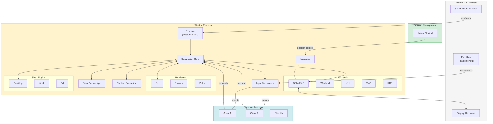
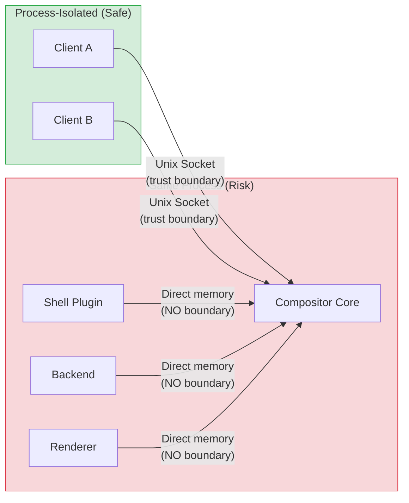
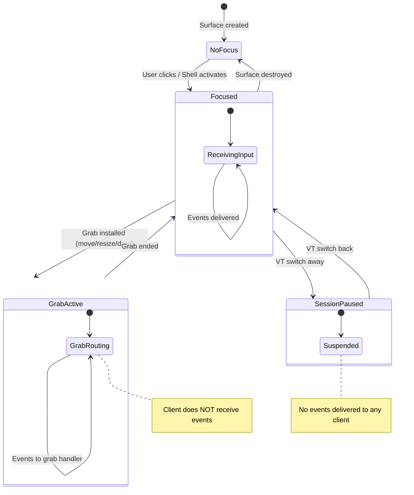
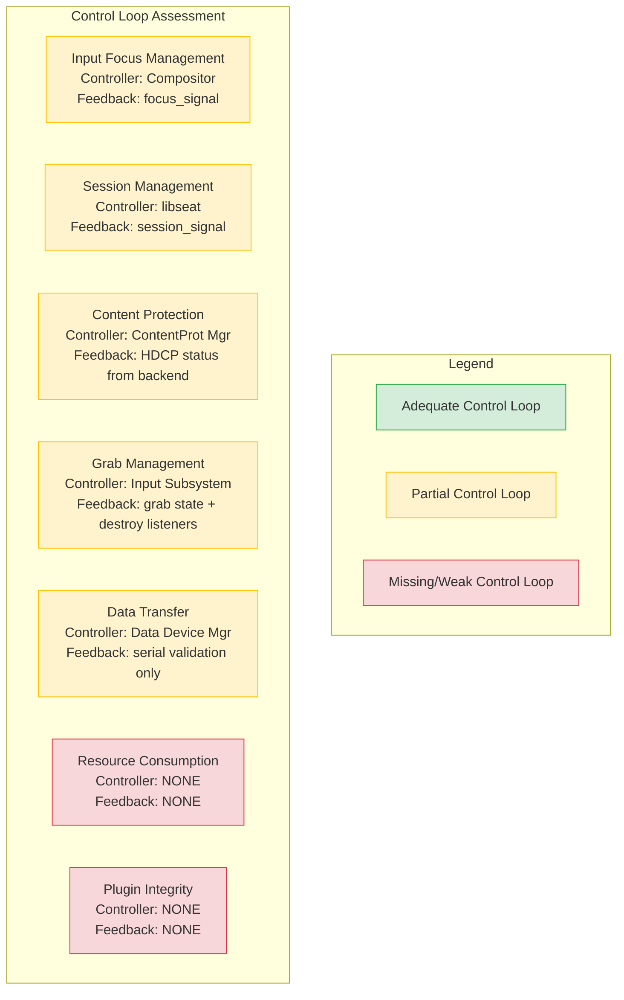

# STAMP/STPA Analysis of Weston Compositor - Executive Summary

**Project:** Weston Compositor v15.0.90 (libweston 16)
**Analysis Date:** 2026-03-29
**Methodology:** STAMP (Systems-Theoretic Accident Model and Processes) / STPA (Systems-Theoretic Process Analysis)

---

## 1. System Overview

Weston is the reference Wayland compositor, serving as a display server that manages
hardware displays, composites client application surfaces, routes input events, and
enforces client isolation. It is used in desktop, automotive, embedded, kiosk, and
industrial environments.

### System Architecture



---

## 2. Analysis Summary

### 2.1 Losses Identified: 7

| ID | Loss | Severity |
|----|------|----------|
| L-1 | Information Disclosure | Critical |
| L-2 | Input Integrity Violation | Critical |
| L-3 | Denial of Service | High |
| L-4 | Privilege Escalation | Critical |
| L-5 | Content Protection Bypass | High |
| L-6 | Session Hijack | Critical |
| L-7 | Data Integrity Loss | Medium |

### 2.2 Hazards Identified: 10

### 2.3 Unsafe Control Actions Identified: 32

### 2.4 Loss Scenarios Identified: 16

### 2.5 Safety Requirements Derived: 30

---

## 3. Key Findings

### 3.1 Critical Trust Boundary: In-Process Shell Plugins



**Finding:** Shell plugins, backends, and renderers share the compositor's process space.
A compromised or buggy shell plugin has full access to all client buffers, input events,
and hardware device FDs. This is the single largest attack surface in Weston's architecture.

### 3.2 Input Focus as Primary Security Control

Input routing in Weston is entirely focus-based. The focus mechanism is the **primary
security control** preventing input events from reaching unauthorized clients. Any
compromise of focus assignment directly leads to information disclosure (L-1) and input
integrity violation (L-2).



### 3.3 Content Protection Timing Gap

The most actionable finding is a race condition between output hotplug and content
protection enforcement. When a new display is connected, there is a window where
protected content may render on an unprotected output before the content protection
module re-evaluates.

### 3.4 Clipboard Broadcast Design

The current clipboard design broadcasts selection events to all clients with a
`wl_data_device` resource, not just the focused client. This is an information
disclosure vector inherent to the current Wayland protocol implementation in Weston.

---

## 4. Risk Heatmap

```mermaid
quadrantChart
    title Risk Assessment: Likelihood vs Impact
    x-axis Low Likelihood --> High Likelihood
    y-axis Low Impact --> High Impact
    quadrant-1 Critical Risk
    quadrant-2 Monitor Closely
    quadrant-3 Acceptable
    quadrant-4 Mitigate When Possible
    Focus Steal (LS-1.3): [0.65, 0.80]
    Surface Destroy Race (LS-1.1): [0.50, 0.78]
    Screenshot Capture (LS-2.1): [0.30, 0.92]
    GL Texture Leak (LS-2.2): [0.25, 0.90]
    Stale FD (LS-3.1): [0.25, 0.88]
    XWayland FD (LS-3.2): [0.10, 0.85]
    Serial Prediction (LS-4.1): [0.10, 0.70]
    Orphaned Grab (LS-4.2): [0.30, 0.85]
    Hotplug Race (LS-5.1): [0.55, 0.80]
    Input Flood (LS-6.1): [0.60, 0.50]
    Commit Storm (LS-6.2): [0.60, 0.45]
    Flip Timeout (LS-6.3): [0.30, 0.70]
    Clipboard Sniff (LS-7.1): [0.75, 0.55]
    DnD Mismatch (LS-7.2): [0.20, 0.40]
```

---

## 5. Top 5 Recommended Actions

### Action 1: Gate Content Protection on Output Assignment
**Scenarios:** LS-5.1, LS-2.1 | **Requirements:** SR-6.1, SR-6.2, SR-2.1

Ensure that content protection evaluation occurs **before** any surface is assigned to a
newly hotplugged output. The first frame on a new output must not contain any protected
surface until the output's protection level (HDCP status) is confirmed by the backend.

**Files:** `libweston/content-protection.c`, `backend-drm/drm.c`

### Action 2: Harden Grab Lifecycle on Client Destroy
**Scenarios:** LS-4.2, LS-1.1 | **Requirements:** SR-4.2, SR-1.4

Ensure grab cancellation and focus clearing happen **before** any other destroy-related
processing in the same event loop iteration. Add a grab timeout mechanism (default 30s)
to catch orphaned grabs from hung clients.

**Files:** `libweston/input.c`, `libweston/data-device.c`

### Action 3: Implement Focus-Steal Prevention
**Scenarios:** LS-1.3 | **Requirements:** SR-1.3

Add a policy in shell plugins that prevents automatic focus activation for newly mapped
surfaces unless triggered by explicit user interaction (pointer click or keyboard
shortcut). This is the single highest-likelihood, high-impact scenario.

**Files:** `desktop-shell/shell.c`, `kiosk-shell/`, `ivi-shell/`

### Action 4: Restrict Clipboard Selection Events
**Scenarios:** LS-7.1 | **Requirements:** SR-7.1

Change the selection event broadcast to only send `data_device.selection` to the
data_device resource associated with the currently keyboard-focused client. This is the
highest-likelihood scenario in the analysis.

**Files:** `libweston/data-device.c`

### Action 5: Add Device FD Registry and Session-Disable Cleanup
**Scenarios:** LS-3.1 | **Requirements:** SR-3.1, SR-5.1

Create a central device FD registry in the launcher subsystem. On session disable, all
registered FDs are closed in a deterministic order (input first, then DRM). Verify
CLOEXEC on all device FDs.

**Files:** `libweston/launcher-util.c`, `libweston/launcher-libseat.c`

---

## 6. Control Loop Completeness Assessment



| Control Loop | Status | Gap |
|-------------|--------|-----|
| Input Focus | Partial | No focus-steal prevention; race on destroy |
| Session Management | Partial | Non-atomic disable sequence; FD cleanup gaps |
| Content Protection | Partial | Hotplug race; capture path bypass |
| Grab Management | Partial | No timeout; destroy ordering windows |
| Data Transfer | Partial | Broadcast clipboard; serial-only validation |
| Resource Consumption | **Missing** | No rate limiting for input or commits |
| Plugin Integrity | **Missing** | No process isolation; no capability restriction |

---

## 7. Document Index

| # | Document | Description |
|---|----------|-------------|
| 1 | [01-overview.md](01-overview.md) | Losses, hazards, system-level safety constraints |
| 2 | [02-control-structure.md](02-control-structure.md) | Hierarchical control structure with Mermaid diagrams |
| 3 | [03-unsafe-control-actions.md](03-unsafe-control-actions.md) | 32 Unsafe Control Actions across 6 controllers |
| 4 | [04-loss-scenarios.md](04-loss-scenarios.md) | 16 loss scenarios with causal factor analysis |
| 5 | [05-safety-requirements.md](05-safety-requirements.md) | 30 derived safety requirements with priorities |
| 6 | [06-summary-report.md](06-summary-report.md) | This executive summary |

---

## 8. Methodology Notes

This analysis follows the STPA handbook (MIT) four-step process:

1. **Define losses and hazards** (Document 01)
2. **Model the control structure** (Document 02)
3. **Identify unsafe control actions** (Document 03)
4. **Identify loss scenarios** (Document 04)

Safety requirements (Document 05) are derived from Steps 3 and 4 as mitigations.

The analysis was performed against the Weston source code at version 15.0.90
(libweston major version 16), examining the actual implementation in C source files
rather than relying solely on documentation.
